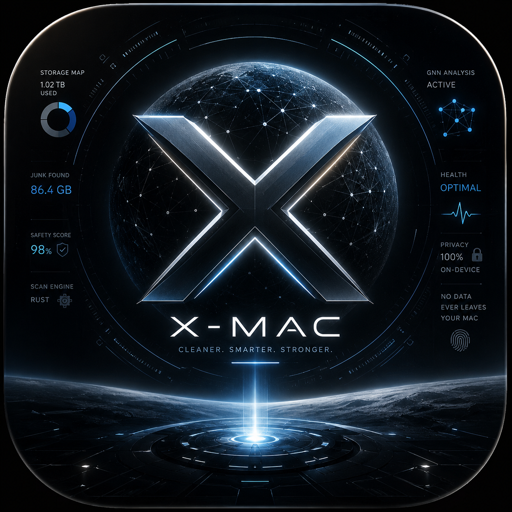

<div align="center">



# X-MaC

**macOS cleaner, optimizer, and system monitor — with on-device GNN intelligence.**

*Cleaner. Smarter. Stronger.*

[](#build--test)
[](https://swift.org)
[](https://www.apple.com/macos)
[](LICENSE)
[](#beta--community)

[Install](#installation) · [How it works](#what-it-does) · [Join the beta](#beta--community) · [Contribute](#contributing)

</div>

---

X-MaC is a free, open-source Mac cleaner that combines a fast Rust scan engine, a Graph Neural Network safety scorer, and a native SwiftUI app — all running entirely on your device. Nothing ever leaves your Mac.

---

## Why X-MaC?

| | CleanMyMac | CleanerOne Pro | **X-MaC** |
|---|:---:|:---:|:---:|
| Free & open-source | ✗ | ✗ | ✅ |
| On-device GNN scoring | ✗ | ✗ | ✅ |
| Native SwiftUI app | ✓ | ✓ | ✅ |
| Rust scan engine | ✗ | ✗ | ✅ |
| Full disk donut chart | ✓ | ✓ | ✅ |
| Never deletes without asking | sometimes | sometimes | ✅ always |
| No subscription | ✗ | ✗ | ✅ |
| CLI + GUI | ✗ | ✗ | ✅ |

---

## What it does

X-MaC has three layers that work together:

```
┌─────────────────────────────────────────────┐
│           SwiftUI App  (gui/)               │  ← What users see
│  Dashboard · Disk Map · Smart Scan · Clean  │
├─────────────────────────────────────────────┤
│      GNN Inference Server  (gnn/)           │  ← On-device AI
│  PyTorch graph model → CoreML on-device     │
├─────────────────────────────────────────────┤
│       Rust Scan Engine  (src/)              │  ← Speed + safety
│  Clean · Disk · Maintain · Map · Depth      │
└─────────────────────────────────────────────┘
```

### GUI features
- **Dashboard** — action-first hero with one-tap Quick Clean, reclaimable total, and a "Recommended next step" card
- **Disk Analyzer** — interactive donut wheel (CleanerOne Pro style) showing macOS System, Applications, named home directories, and free space with live hover tooltips
- **Smart Scan (GNN)** — graph neural network scores every finding by safety; anomaly detection; cross-directory pattern analysis
- **Full Scan** — select safe items, clean with confirmation, success banner
- **Maintain** — per-task Fix buttons (Spotlight re-index, cache reveal, LaunchAgent repair)
- **App Inventory** — maps every installed app to its leftover files, caches, and support directories
- **History** — re-run past scans, export findings
- **Automation** — scheduled scans, quiet hours, configurable notifications
- **Onboarding** — first-launch animated walkthrough
- **Crash reporter + adaptive fixer** — logs errors, auto-applies known recovery patterns

### Rust CLI features
```bash
xmac clean       # find reclaimable space (caches, build artifacts, browsers…)
xmac disk        # disk usage breakdown with APFS-accurate volume stats
xmac maintain    # flush DNS, reindex Spotlight, rebuild LaunchServices…
xmac scan        # full system scan
xmac quick       # clean + maintain + disk in one shot
xmac map         # map Python/Node/container environments
xmac conflict    # detect PATH and environment conflicts
xmac depth       # filesystem integrity (permissions, broken symlinks, dylibs)
```

---

## Screenshots

> _Full scan in progress, GNN safety scores visible per finding:_

```
coming soon — help us take some!
```

---

## Installation

### macOS App (GUI)

**Requirements:** macOS 13 Ventura or later, Apple Silicon or Intel.

```bash
git clone https://github.com/davidnichols-ops/X-MaC.git
cd X-MaC/gui
./build_app.sh
cp -r staging/X-MaC.app /Applications/
open /Applications/X-MaC.app
```

The build script compiles the Rust binary, bundles it inside the `.app`, and copies the CoreML GNN model — no external dependencies at runtime.

### CLI only

```bash
git clone https://github.com/davidnichols-ops/X-MaC.git
cd X-MaC
cargo build --release
./target/release/x-mac install   # installs xmac to ~/.local/bin
xmac quick
```

### Requirements

| Component | Requirement |
|---|---|
| GUI build | Xcode 15+, Swift 5.9+, macOS 13+ SDK |
| CLI build | Rust 1.78+ (`rustup update stable`) |
| GNN training | Python 3.10+, PyTorch 2.x (optional — pre-trained model included) |

---

## Project Structure

```
X-MaC/
├── src/                    # Rust scan engine (the core)
│   ├── engines/
│   │   ├── clean/          # Cache, build artifact, browser, iOS backup scanner
│   │   ├── disk/           # APFS-aware disk usage analyzer
│   │   ├── maintain/       # macOS maintenance tasks
│   │   ├── graph/          # GNN integration (Rust side)
│   │   ├── map/            # Python/Node/container environment mapper
│   │   └── depth/          # Filesystem integrity checker
│   ├── core/               # Engine trait, types, context, error handling
│   ├── cleanup/            # Safe deletion: trash-first, dry-run, undo history
│   └── cli/                # Clap CLI, argument parsing, output formatters
│
├── gnn/                    # On-device Graph Neural Network
│   ├── model/              # PyTorch GNN architecture
│   ├── data/               # Graph construction from scan findings
│   ├── server/             # Inference server (called by Swift via XPC)
│   └── XMacGNN.mlpackage   # Pre-trained CoreML model (ready to use)
│
├── gui/                    # Native SwiftUI macOS app
│   └── XMacApp/
│       └── Sources/XMacApp/
│           ├── XMacApp.swift           # App entry point
│           ├── XMacRunner.swift        # Rust bridge (process runner)
│           ├── ContentView.swift       # Sidebar + navigation
│           ├── DashboardView.swift     # Hero dashboard
│           ├── DiskView.swift          # Donut chart disk analyzer
│           ├── NeuralScanView.swift    # GNN smart scan
│           ├── FullScanView.swift      # Full scan with cleanup toolbar
│           ├── CleanView.swift         # Category-based cleaner
│           ├── MaintainView.swift      # Maintenance tasks
│           ├── AppInventoryView.swift  # App leftover mapper
│           ├── AutomationView.swift    # Scheduled scans
│           ├── DashboardView.swift     # Action-first dashboard
│           ├── OnboardingView.swift    # First-launch flow
│           ├── CrashReporter.swift     # Error logging
│           ├── AdaptiveFixer.swift     # Auto-recovery engine
│           └── Models.swift            # Shared types + FilePathDisplay
│
└── tests/                  # Rust integration tests
```

---

## Architecture deep-dive

### Rust engine

The scan engine is built around an async `Engine` trait. Every scanner implements three methods: `validate`, `scan`, and `name`. The context object (`ScanContext`) collects findings via an async channel so the GUI can stream results in real time.

```rust
#[async_trait]
pub trait Engine: Send + Sync {
    fn id(&self) -> EngineId;
    async fn validate(&self, ctx: &ScanContext) -> Result<(), EngineError>;
    async fn scan(&self, ctx: Arc<ScanContext>) -> Result<EngineStats, EngineError>;
}
```

Findings are typed (`Category`, `Severity`, `Target`) and carry:
- `size_bytes` — physical block size via `stat.st_blocks * 512` (correct for APFS sparse files)
- `remediation_hint` — either a human description or a machine-readable JSON blob (used by the disk chart)
- `neural_score` — GNN safety score (0–1) injected after inference

Cleanup is **always trash-first** — `FileManager.trashItem` in Swift, never `rm -rf`. Permanent deletion requires a second confirmation.

### GNN model

The GNN (`gnn/`) takes the scan findings graph as input:
- Nodes = findings (category, size, path depth, extension)
- Edges = same-directory, same-app, same-category relationships

The graph is scored through a 3-layer GCN → MLP → sigmoid. Output is a per-node safety score (0 = risky, 1 = safe to clean). The model is exported to CoreML (`XMacGNN.mlpackage`) and runs entirely on-device — no network required.

### Swift ↔ Rust bridge

`XMacRunner.swift` manages the `xmac` subprocess, writes arguments, reads NDJSON findings line-by-line, and publishes them as `@Published var findings: [Finding]`. The bundled binary lives at `Contents/MacOS/xmac` so there are no external dependencies.

---

## Beta & Community

We're looking for **macOS developers** to:
- Test on different Mac configurations (Intel, M1/M2/M3/M4, different macOS versions)
- Review the Rust scan logic for false positives
- Improve the SwiftUI code quality
- Help tune the GNN model with real scan data
- Report bugs and suggest features

**How to get involved:**
1. Star and watch this repo for updates
2. Open an issue with your Mac model + macOS version — even just "it ran fine" is useful
3. Try the beta build and file a bug if anything looks wrong
4. Join the discussion in [GitHub Discussions](https://github.com/davidnichols-ops/X-MaC/discussions)

> No telemetry, no accounts, no sign-up. Just build and run.

---

## Contributing

All contributions welcome — from a one-line typo fix to a new scan engine.

### Getting started

```bash
git clone https://github.com/davidnichols-ops/X-MaC.git
cd X-MaC

# Build and test the Rust engine
cargo build --release
cargo test

# Build the GUI
cd gui && ./build_app.sh
```

### Before opening a PR

- `cargo build --release` — zero errors, ideally zero warnings
- `cargo test` — all 67+ tests pass
- Swift: `cd gui/XMacApp && swift build` — clean build
- New scan categories need a test in `tests/`
- GUI changes should match the existing `XTheme` style system

### Good first issues

- [ ] Add a "Largest files" view inside a directory when you click a donut segment
- [ ] Export scan results as CSV
- [ ] Localization (the UI is English-only right now)
- [ ] Dark/light mode theming (currently dark-only)
- [ ] TestFlight / notarization workflow
- [ ] Add more GNN training data and improve model accuracy
- [ ] Brew tap for `xmac` CLI

### Adding a new scan engine (Rust)

1. Create `src/engines/<name>/mod.rs` and implement the `Engine` trait
2. Add a new `EngineId` variant in `src/core/types.rs`
3. Register in `src/engines/mod.rs`
4. Wire into `src/cli/args.rs` and the relevant `run_*` function in `src/main.rs`
5. Add integration tests in `tests/`

### Adding a new view (SwiftUI)

1. Create `gui/XMacApp/Sources/XMacApp/<Name>View.swift`
2. Follow the `XTheme` / `XCard` / `XSectionHeader` style — see `Models.swift`
3. Add a case to `AppSection` in `ContentView.swift`
4. Wire up the runner call in `XMacRunner.swift`

---

## Roadmap

- [ ] **v1.1** — TestFlight public beta + notarized DMG
- [ ] **v1.2** — Duplicate file finder with visual diff
- [ ] **v1.3** — Space Lens (drill-down treemap like Disk Diag)
- [ ] **v1.4** — GNN model improvements with community scan data (opt-in, anonymised)
- [ ] **v2.0** — App Store submission

---

## License

MIT — do whatever you want, attribution appreciated.

---

## Acknowledgements

Built with:
- [Rust](https://www.rust-lang.org/) + [Tokio](https://tokio.rs/) — async scan engine
- [SwiftUI](https://developer.apple.com/xcode/swiftui/) — native macOS UI
- [PyTorch](https://pytorch.org/) + [Core ML](https://developer.apple.com/documentation/coreml) — on-device GNN
- [WalkDir](https://github.com/BurntSushi/walkdir) — fast filesystem traversal
- [Clap](https://clap.rs/) — CLI argument parsing
