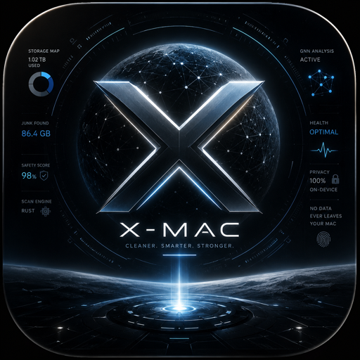

<div align="center">



# X-MaC

### Open-source macOS cleaner, optimizer & system monitor — with on-device GNN intelligence

[](https://github.com/davidnichols-ops/X-MaC/actions/workflows/ci.yml)
[](https://www.rust-lang.org/)
[](https://swift.org)
[](https://www.apple.com/macos)
[](LICENSE)
[](#testing)

[Install](#installation) · [Features](#features) · [Architecture](#architecture) · [Contributing](CONTRIBUTING.md) · [Roadmap](ROADMAP.md)

</div>

---

X-MaC is a free, open-source Mac cleaner that combines a fast Rust scan engine, a Graph Neural Network safety scorer, and a native SwiftUI app — all running entirely on your device. Nothing ever leaves your Mac.

> **Status:** v1 scope is frozen — see [`SCOPE_FREEZE.md`](SCOPE_FREEZE.md). Three v1 capabilities are locked: find safely-deletable duplicates, explain why your disk is full, and a system health scan with recommendations. Other engines (GNN auto-scoring, privacy recommendations, hardware reasoning, perceptual similarity beyond exact duplicates) are deferred to v2 or archived. The CLI is stable; the GUI is feature-complete but not yet notarized.

## The 3 things X-MaC does in v1

X-MaC v1 has exactly three user-visible capabilities. Everything else is either
deferred to v2 or archived.

### 1. Find safely-deletable duplicate files

```bash
xmac dedup ~/Downloads --min-size 1M
xmac dedup ~/Photos --similar        # v2: perceptual image similarity
```

Walks a directory tree, groups files by BLAKE3 hash, returns a reviewable
list of duplicate clusters with a recommended file to keep (newest +
highest-priority path). **Nothing is deleted by `xmac dedup`** — review the
JSON output and use `xmac purge` to act on it.

### 2. Explain why your disk is full

```bash
xmac disk ~/Projects --explain
xmac disk / --top 50 --by category
```

Categorizes what's on your disk — caches, dev artifacts, media, archives,
applications, backups, duplicates, unknown — and shows the top reclaimable
items per category with the evidence behind each recommendation.

### 3. System health scan + recommendations

```bash
xmac scan --recommend
xmac doctor --severity medium
```

Runs a privacy-redacted scan of your system (OS, packages, apps, startup
items, disk) and produces a prioritized list of recommendations. Each
recommendation shows what-it-is, why-it-matters, the evidence, a safety
rating, the proposed action, and the undo path.

### Shared guarantees

All three capabilities share the same contract:

- **Read-only by default.** No filesystem modification unless you run `xmac purge <plan>`.
- **Always show evidence.** Every recommendation cites the file, path, process, or setting behind it.
- **Always reversible.** Destructive actions go through the safety state machine: PREVIEW → APPROVED → EXECUTING → VERIFIED → ROLLBACK AVAILABLE.
- **No AI confidence overrides safety.** A high-confidence model recommendation still passes the same action policy.

For the full contract, see [`docs/PRODUCT_TRUTH_TABLE.md`](docs/PRODUCT_TRUTH_TABLE.md).
For the scope decision and what's NOT v1, see [`SCOPE_FREEZE.md`](SCOPE_FREEZE.md).
For the dead-code survey that backs the scope decision, see [`docs/DEAD_CODE_SURVEY.md`](docs/DEAD_CODE_SURVEY.md).

## Features (full list)

The CLI exposes the three v1 capabilities above plus the broader scan
surface (most used internally by v1):

## Why X-MaC?

| | CleanMyMac | CleanerOne Pro | **X-MaC** |
|---|:---:|:---:|:---:|
| Free & open-source | ✗ | ✗ | ✅ |
| On-device GNN scoring | ✗ | ✗ | ✅ |
| Rust scan engine | ✗ | ✗ | ✅ |
| CLI + GUI | ✗ | ✗ | ✅ |
| Never deletes without asking | sometimes | sometimes | ✅ always |
| No subscription | ✗ | ✗ | ✅ |
| Config profiles (Gaming, Dev, etc.) | ✗ | ✗ | ✅ |
| Background daemon | ✗ | ✗ | ✅ |
| AI advisor | ✗ | ✗ | ✅ |

## Features

### CLI

```bash
xmac quick              # clean + maintain + disk overview in one shot
xmac clean              # find reclaimable space (caches, build artifacts, browsers, Docker)
xmac purge              # clean + delete with confirmation and undo
xmac purge --preview    # show every file that will be moved, grouped by category
xmac purge --yes        # skip confirmation (for automation / non-TTY)
xmac disk               # disk usage breakdown with APFS-accurate stats
xmac disk --explain     # categorize what's eating your disk (capability #2)
xmac maintain           # flush DNS, reindex Spotlight, rebuild LaunchServices
xmac scan               # full system scan (all engines including privacy)
xmac doctor             # alias for scan — system health + recommendations (capability #3)
xmac map                # map Python/Node/container environments
xmac conflict           # detect PATH and environment conflicts
xmac depth              # filesystem integrity (permissions, symlinks, dylibs)
xmac advisor            # AI advisor — natural-language system health recommendations
xmac zen                # one-click comprehensive optimization (preview or execute)
xmac optimize           # memory telemetry, graph building, pressure prediction
xmac ram-boost          # purge inactive RAM, show top memory consumers
xmac config             # manage config, profiles, settings
xmac daemon             # background daemon with auto-purge and automation rules
xmac history            # scan history and analytics
xmac completions        # generate shell completions (zsh, bash, fish, elvish, powershell)
```

**Output formats:** `--format report` (default, human-readable), `--format json` (NDJSON, one finding per line), `--format json-pretty` (indented array), `--format csv` (spreadsheet export).

### GUI (macOS only)

- **Dashboard** — action-first hero with one-tap Quick Clean and reclaimable total
- **Zen Mode** — one-click comprehensive optimization with before/after health score
- **AI Advisor** — health score ring, system status, prioritized recommendations
- **Disk Analyzer** — interactive donut chart with live hover tooltips
- **Smart Scan (GNN)** — graph neural network scores every finding by safety
- **Clean / Maintain / Map / Depth** — full engine access with category breakdowns
- **Menu Bar Extra** — quick access to Zen Mode, AI Advisor, and Quick Clean from the system menu bar
- **RAM Boost** — purge inactive memory with before/after comparison
- **Onboarding** — first-launch walkthrough
- **Crash reporter + adaptive fixer** — logs errors, auto-applies known recovery patterns
- **Scan history** — view past scans and savings over time
- **Settings** — config profiles, cleanup policies, per-category controls

### Intelligence Suite

- **Config profiles** — 7 profiles (Balanced, Gaming, Development, Video Editing, Conservative, Aggressive, Custom) that tune engine thresholds
- **Background daemon** — auto-purge on memory pressure, auto-clean on disk pressure, automation rules with cooldowns, graceful shutdown via SIGTERM/SIGINT
- **AI Advisor** — multi-dimensional system awareness (CPU + memory + thermal + battery + disk) with natural-language recommendations
- **Zen Mode** — comprehensive optimization with preview, before/after health score, memory delta, disk reclaimable summary
- **Adaptive learning** — tracks user feedback to adjust advisor confidence over time
- **History & analytics** — scan history with export and trend tracking

### Safe Cleanup

- **Trash-first** — files go to Trash, never `rm -rf`
- **Trusted preview** — `xmac purge --preview` shows every file that will be moved, grouped by category with sizes and safety ratings, before any action
- **Interactive confirmation** — `xmac purge` prompts before executing unless `--yes` is passed
- **Dry-run mode** — `xmac purge --dry-run` simulates without touching the filesystem
- **BLAKE3 verification** — `FileSnapshot` captures size, mtime, and optional BLAKE3 hash for cryptographic TOCTOU protection
- **Undo support** — every cleanup transaction records undo metadata
- **Verification** — post-cleanup verification confirms files were moved
- **Preflight checks** — every candidate is validated before deletion

## Architecture

```
┌─────────────────────────────────────────────────────┐
│              SwiftUI App  (gui/)                    │  ← What users see
│  Dashboard · Zen · Advisor · Disk · Clean · Menu Bar │
├─────────────────────────────────────────────────────┤
│         Intelligence Suite  (src/intelligence/)     │  ← AI + automation
│  Advisor · Daemon · Zen Mode · System Awareness     │
├─────────────────────────────────────────────────────┤
│          Config System  (src/config/)               │  ← User preferences
│  Profiles · TOML Store · Automation Rules           │
├─────────────────────────────────────────────────────┤
│       GNN Inference  (gnn/ + CoreML on-device)      │  ← Safety scoring
│  PyTorch GAT → CoreML → on-device inference         │
├─────────────────────────────────────────────────────┤
│         Rust Scan Engine  (src/engines/)            │  ← Speed + safety
│  Clean · Disk · Maintain · Map · Depth · Optimize   │
│  Conflict · Envmap · Graph · Diag                   │
├─────────────────────────────────────────────────────┤
│         Safe Cleanup  (src/cleanup/)                │  ← Trash-first
│  Transaction · Undo · Verification · Preflight      │
└─────────────────────────────────────────────────────┘
```

See [docs/ARCHITECTURE.md](docs/ARCHITECTURE.md) for detailed diagrams and module relationships.

## Installation

### macOS App (GUI + CLI)

**Requirements:** macOS 13 Ventura or later, Apple Silicon or Intel.

```bash
git clone https://github.com/davidnichols-ops/X-MaC.git
cd X-MaC/gui
./build_app.sh
cp -r staging/X-MaC.app /Applications/
open /Applications/X-MaC.app
```

The build script compiles the Rust binary, bundles it inside the `.app` along with the CoreML model — no external dependencies at runtime.

> **Note:** The app is not yet notarized. On first launch, macOS Gatekeeper will block it. The safest approach is to verify the download's integrity and then right-click → Open to allow it. Do not use `xattr -cr` as it removes all security attributes from the bundle.

### CLI only

```bash
git clone https://github.com/davidnichols-ops/X-MaC.git
cd X-MaC
cargo build --release
./target/release/x-mac install   # installs xmac to ~/.local/bin
xmac quick
```

### Homebrew (formula exists, tap not yet published)

```bash
# Once the tap is published:
brew tap davidnichols-ops/xmac
brew install xmac
```

### Linux

```bash
git clone https://github.com/davidnichols-ops/X-MaC.git
cd X-MaC
cargo build --release
./target/release/x-mac quick --no-disk
```

macOS-specific features (Spotlight, LaunchServices, purge) gracefully degrade on Linux. The GUI is macOS-only (SwiftUI).

### Requirements

| Component | Requirement |
|---|---|
| CLI build | Rust 1.78+ (`rustup update stable`) |
| GUI build | Xcode 15+, Swift 5.9+, macOS 13+ SDK |
| GNN training | Python 3.10+, PyTorch 2.x (optional — pre-trained model included) |

## Quick Start

```bash
# See what can be cleaned (no deletion)
xmac clean

# Get AI recommendations for your system
xmac advisor

# Preview a comprehensive optimization
xmac zen --no-clean --no-maintain

# Run safe cleanup + maintenance + disk overview
xmac quick

# Export results as CSV
xmac --format csv clean > findings.csv

# Set a gaming profile (aggressive memory cleanup)
xmac config set-profile gaming

# Start the background daemon
xmac daemon --start

# Generate shell completions
xmac completions --shell zsh > ~/.zsh/completions/_xmac
```

## Configuration

X-MaC reads config from `~/.config/xmac/config.toml` (or `~/Library/Application Support/xmac/config.toml` on macOS).

```bash
xmac config init              # create default config
xmac config profiles          # list available profiles
xmac config set-profile gaming  # switch to gaming profile
xmac config get clean.min_age_days
xmac config set clean.min_age_days 7
```

See [examples/configs/](examples/configs/) for sample configurations (default, gaming, development, conservative) and [docs/ARCHITECTURE.md](docs/ARCHITECTURE.md) for config system details.

## Project Structure

```
X-MaC/
├── src/                    # Rust engine (the core)
│   ├── core/               # Engine trait, types, context, errors
│   ├── engines/            # 10 scan engines
│   │   ├── clean/          # Cache, build artifact, browser, Docker, iOS backup scanner
│   │   ├── disk/           # APFS-aware disk usage analyzer
│   │   ├── maintain/       # macOS/Linux maintenance tasks
│   │   ├── optimize/       # Memory optimizer with GNN telemetry
│   │   ├── graph/          # GNN integration (Rust side)
│   │   ├── map/            # Python/Node/container environment mapper
│   │   ├── depth/          # Filesystem integrity checker
│   │   ├── conflict/       # PATH and environment conflict detector
│   │   ├── envmap/         # Environment variable mapper
│   │   └── diag/           # System diagnostics
│   ├── cleanup/            # Safe deletion: trash-first, dry-run, undo
│   ├── cli/                # Clap CLI, argument parsing, output (text/JSON/CSV)
│   ├── config/             # TOML config, optimization profiles
│   ├── intelligence/       # System awareness, AI advisor, daemon, zen mode
│   └── util/               # Disk, memory, macOS, backup utilities
│
├── gui/                    # Native SwiftUI macOS app (30 Swift source files)
│   └── XMacApp/
│       └── Sources/XMacApp/
│           ├── XMacApp.swift        # App entry point + menu bar extra
│           ├── XMacRunner.swift     # Rust bridge (subprocess + NDJSON)
│           ├── ContentView.swift    # Sidebar + navigation
│           ├── DashboardView.swift  # Hero dashboard
│           ├── ZenView.swift        # Zen Mode optimization
│           ├── AdvisorView.swift    # AI Advisor
│           ├── DiskView.swift       # Donut chart disk analyzer
│           ├── NeuralScanView.swift # GNN smart scan
│           ├── CoreMLGNN.swift      # On-device CoreML inference
│           └── ...
│
├── gnn/                    # On-device Graph Neural Network
│   ├── model/              # PyTorch GNN architecture
│   ├── data/               # Training data (PyG format)
│   ├── train.py            # Training script
│   ├── export_coreml.py    # CoreML export
│   ├── server/             # Optional HTTP inference server (dev only)
│   ├── XMacGNN.mlpackage   # Pre-trained CoreML model (safety scoring)
│   └── XMacMemoryGNN.mlpackage  # Pre-trained CoreML model (memory optimization)
│
├── tests/                  # Rust integration tests (daemon lifecycle)
├── docs/                   # Architecture docs, design principles, style guide
├── examples/               # Example configs and CLI usage
├── scripts/                # Helper scripts (check, build, install)
├── packaging/              # Homebrew formula
└── .github/                # CI workflows, issue/PR templates
```

## Testing

```bash
cargo test                  # run all 870+ tests
cargo test --lib            # library tests only (fast)
cargo test -- --nocapture   # with output
cargo clippy -- -D warnings # lint (zero warnings)
cargo fmt --check           # format check
cargo bench --bench scan_benchmark  # performance benchmarks
```

### Benchmarks

The benchmark suite measures scan throughput on synthetic directory trees,
including a **500K+ file corpus** as required by the v1 Definition of Done.

| Benchmark | Metric | Result (M4) |
|-----------|--------|-------------|
| `disk_walk/1000` | files/sec | 635K files/sec |
| `disk_walk/10000` | files/sec | 491K files/sec |
| `disk_walk/100000` | files/sec | 494K files/sec |
| `disk_walk/500000` | total time | 9.3s (53.8K files/sec) |
| `blake3_hash/1MB` | throughput | 1.71 GiB/s |
| `file_snapshot/10000` | files/sec | 217K files/sec |

Run with: `cargo bench --bench scan_benchmark`

Test coverage:
- **168 library tests** — engine logic, config, cleanup, intelligence, CLI
- **168 binary tests** — CLI integration, argument parsing
- **7 daemon integration tests** — lifecycle, PID management, signal handling
- **67 cleanup tests** — transaction safety, undo, verification

See [DEVELOPMENT.md](DEVELOPMENT.md) for detailed testing instructions.

## Contributing

All contributions welcome — from a one-line typo fix to a new scan engine.

See [CONTRIBUTING.md](CONTRIBUTING.md) for the full guide, and [GOOD_FIRST_ISSUES.md](GOOD_FIRST_ISSUES.md) for beginner-friendly tasks.

Quick start:
```bash
git clone https://github.com/davidnichols-ops/X-MaC.git
cd X-MaC
cargo build && cargo test
```

## Roadmap

See [ROADMAP.md](ROADMAP.md) for the full roadmap.

**Done:**
- ✅ CSV export (`--format csv`)
- ✅ Shell completions (`xmac completions`)
- ✅ Docker cache detection (`--docker`)
- ✅ Homebrew formula (tap not yet published)
- ✅ Daemon signal handling fix

**In progress:**
- Homebrew tap publication + notarized DMG
- GNN memory model final accuracy verification

**Planned:**
- Duplicate file finder with BLAKE3 hashing
- Space Lens drill-down treemap
- App Store submission
- Cross-platform GUI (Linux via Tauri)
- Plugin system for custom scan engines

## License

MIT — see [LICENSE](LICENSE). Do whatever you want, attribution appreciated.

## Acknowledgements

Built with:
- [Rust](https://www.rust-lang.org/) + [Tokio](https://tokio.rs/) — async scan engine
- [SwiftUI](https://developer.apple.com/xcode/swiftui/) — native macOS UI
- [PyTorch](https://pytorch.org/) + [Core ML](https://developer.apple.com/documentation/coreml) — on-device GNN
- [WalkDir](https://github.com/BurntSushi/walkdir) — fast filesystem traversal
- [Clap](https://clap.rs/) + [clap_complete](https://docs.rs/clap_complete) — CLI argument parsing + shell completions
