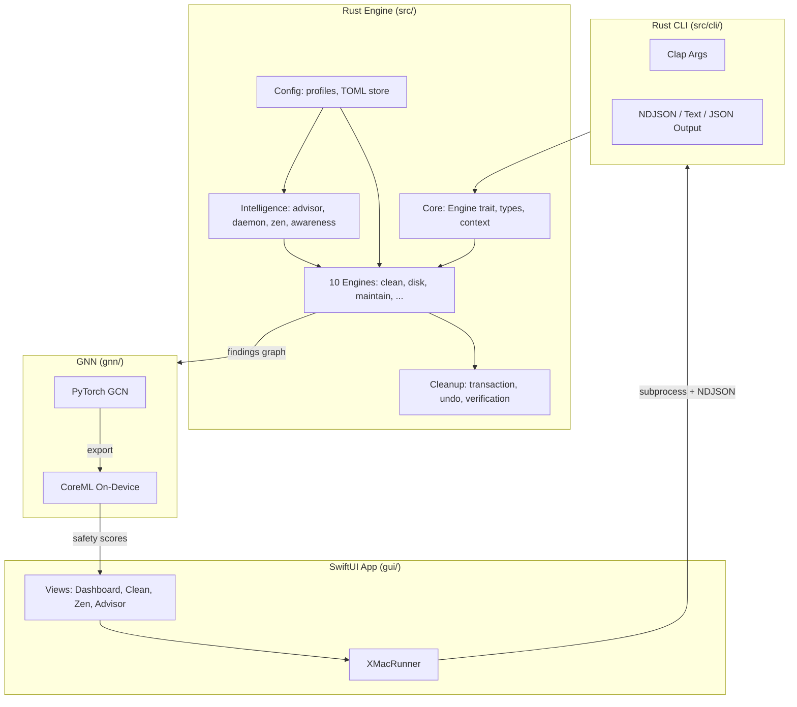
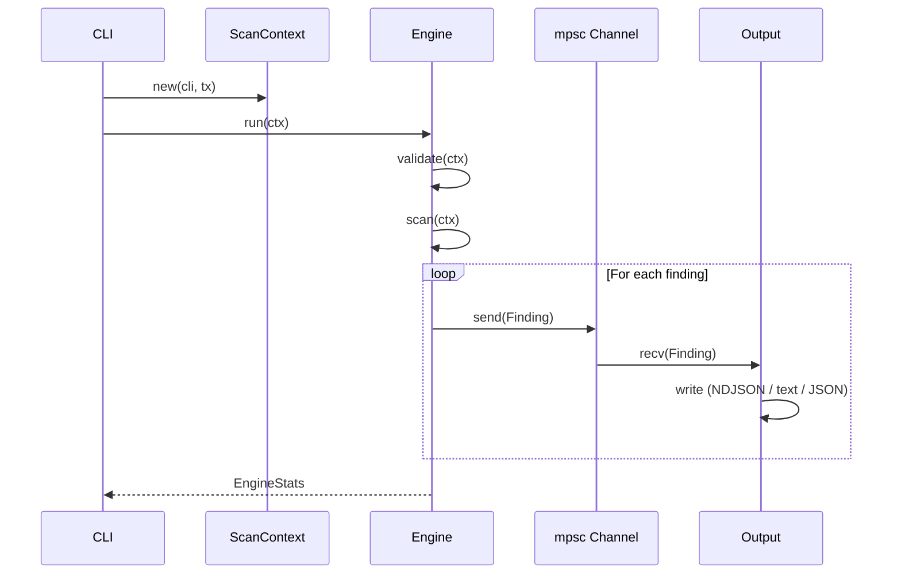
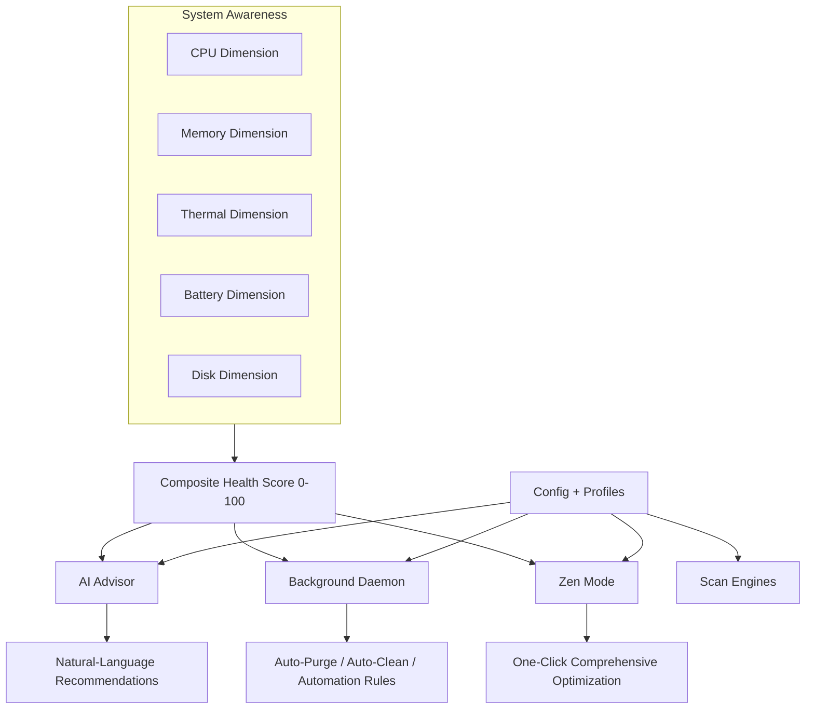
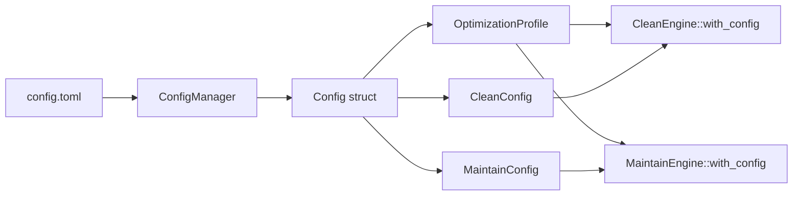
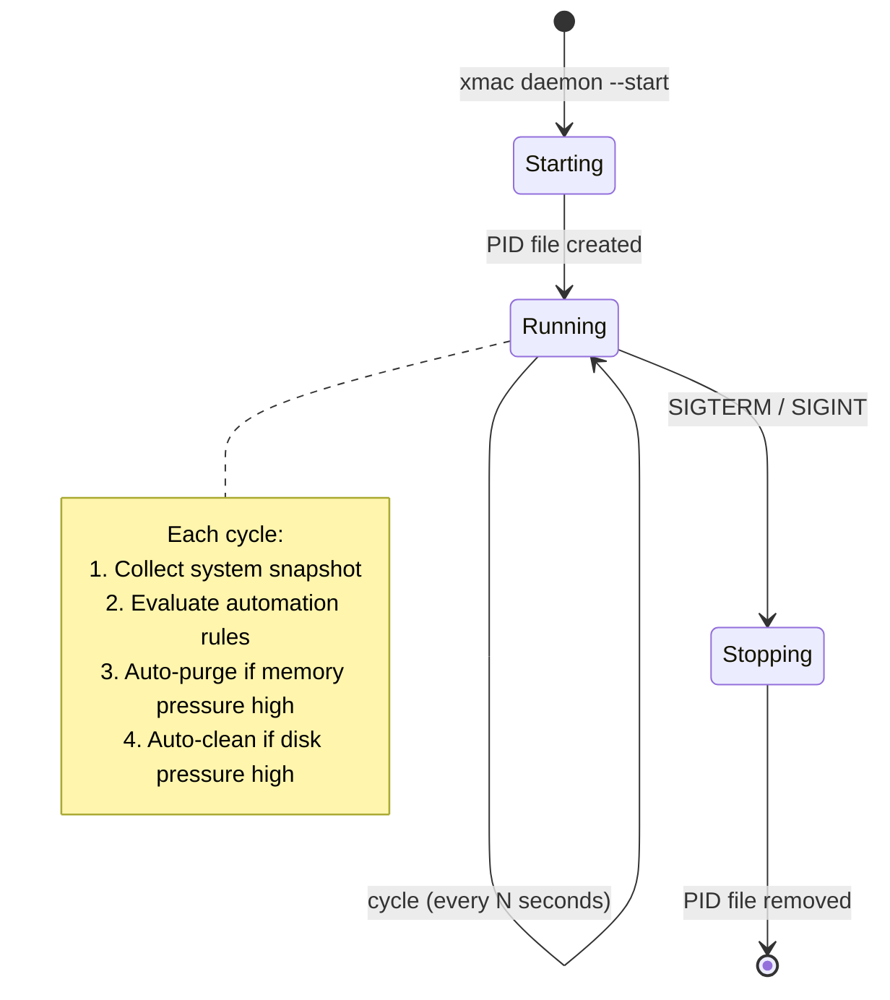
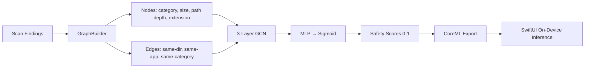
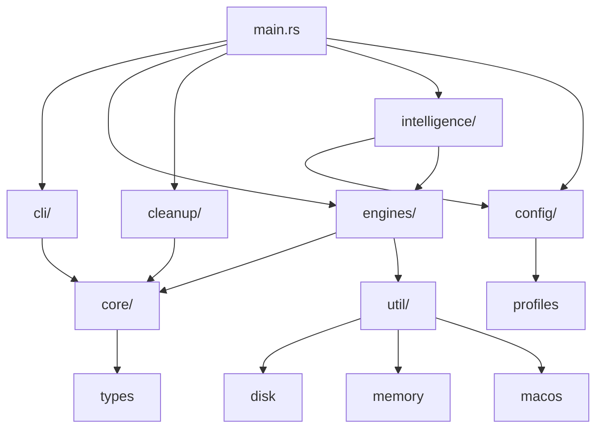

# Architecture

This document explains the system design, module relationships, and key data flows.

## System Overview



## Layers

X-MaC has four layers, each with clear boundaries:

1. **GUI Layer** (`gui/`) — SwiftUI app. Communicates with the Rust engine via subprocess + NDJSON streaming. Never directly accesses the filesystem for scanning.

2. **CLI Layer** (`src/cli/`) — Clap-based argument parsing, output formatting (text, JSON, NDJSON). Thin wrapper over the engine layer.

3. **Engine Layer** (`src/engines/`, `src/cleanup/`, `src/intelligence/`) — The core logic. Each engine implements the `Engine` trait and produces `Finding` objects. The cleanup module handles safe deletion. The intelligence module provides system awareness, AI advisor, and daemon.

4. **GNN Layer** (`gnn/`) — PyTorch graph neural network for safety scoring. Trained offline, exported to CoreML, runs on-device. The GUI loads the CoreML model directly; the Rust engine doesn't call the GNN.

## Engine Trait

Every scanner implements the same async trait:

```rust
#[async_trait]
pub trait Engine: Send + Sync {
    fn id(&self) -> EngineId;
    fn name(&self) -> &'static str;
    async fn validate(&self, ctx: &ScanContext) -> Result<(), EngineError>;
    async fn scan(&self, ctx: Arc<ScanContext>) -> Result<EngineStats, EngineError>;
}
```

The `ScanContext` holds shared state and an async channel (`mpsc::Sender<Finding>`). Engines push findings through the channel as they discover them, enabling real-time streaming to the GUI.



## Engines

| Engine | ID | Purpose |
|--------|----|---------| 
| Clean | `clean` | Find reclaimable space: caches, build artifacts, browser data, iOS backups, temp files, large files, trash |
| Disk | `disk` | APFS-aware disk usage breakdown by directory |
| Maintain | `maintain` | macOS maintenance: DNS flush, Spotlight reindex, LaunchServices rebuild, periodic scripts, RAM purge |
| Map | `map` | Map Python/Node/container environments and their disk usage |
| Depth | `depth` | Filesystem integrity: permissions, broken symlinks, missing dylibs |
| Conflict | `conflict` | Detect PATH conflicts, environment variable collisions, port conflicts |
| Envmap | `envmap` | Map environment variables across shells, apps, and config files |
| Graph | `graph` | GNN integration (Rust side) — builds finding graph for inference |
| Diag | `diag` | System diagnostics (same as Scan) |
| Optimize | `optimize` | Memory optimization with GNN-based telemetry |

## Cleanup Pipeline


Key safety principles:
- **Trash-first** — files go to Trash, never `rm -rf`
- **Dry-run by default** — `xmac clean` scans but doesn't delete
- **Explicit confirmation** — `xmac purge` requires confirmation
- **Undo support** — every transaction records undo metadata
- **Verification** — post-cleanup verification confirms files were moved

## Intelligence Suite



### Config System

Configuration lives at `~/.config/xmac/config.toml` (or `~/Library/Application Support/xmac/config.toml` on macOS). It controls:

- **Optimization profile** — tunes engine thresholds (Gaming = aggressive, Conservative = minimal)
- **Clean settings** — min age, min size, category toggles
- **Maintain settings** — which maintenance tasks to run
- **Daemon settings** — auto-purge threshold, auto-clean threshold, check interval
- **Automation rules** — condition → action mappings with cooldowns
- **Adaptive learning** — tracks user feedback to adjust advisor confidence

Profiles are applied to engines via `with_config()`:



### Daemon Lifecycle



## GNN Pipeline



The GNN runs entirely on-device. No network calls are made. The model is bundled in the `.app` at `Contents/Resources/XMacGNN.mlpackage`.

## Data Types

### Finding

The central data structure, produced by every engine:

```rust
pub struct Finding {
    pub id: Uuid,
    pub engine_id: EngineId,
    pub severity: Severity,      // Critical, High, Medium, Low, Info
    pub category: Category,      // Cache, BuildArtifact, BrowserData, ...
    pub target: Target,          // Path(path), App(name), SystemInfo
    pub title: String,
    pub description: String,
    pub remediation_hint: String,
    pub size_bytes: Option<u64>, // physical block size (APFS-accurate)
    pub neural_score: Option<f64>, // GNN safety score 0-1
    pub timestamp: chrono::DateTime<chrono::Utc>,
}
```

### Output Formats

The CLI supports three output formats via `--format`:
- **text** (default) — human-readable, colored
- **json** — single JSON object
- **ndjson** — newline-delimited JSON (one finding per line, for streaming to GUI)

## Extension Points

| Want to add... | Where | How |
|----------------|-------|-----|
| New scan engine | `src/engines/<name>/` | Implement `Engine` trait, register in `mod.rs` |
| New cleanup category | `src/core/types.rs` | Add `Category` variant, add scanning logic |
| New config option | `src/config/store.rs` | Add field to config struct, wire into engine |
| New GUI view | `gui/XMacApp/Sources/` | Create view, add to `ContentView` sidebar |
| New GNN model | `gnn/model/` | Train, export to CoreML, bundle in app |
| New automation rule | `config.toml` | Add rule with condition + action |

## Module Dependencies



**Key rule:** `core/` has no dependencies on other modules. `engines/` depends on `core/` and `util/`. `intelligence/` depends on `config/` and `engines/`. `cli/` depends on `core/` only. This prevents circular dependencies.
